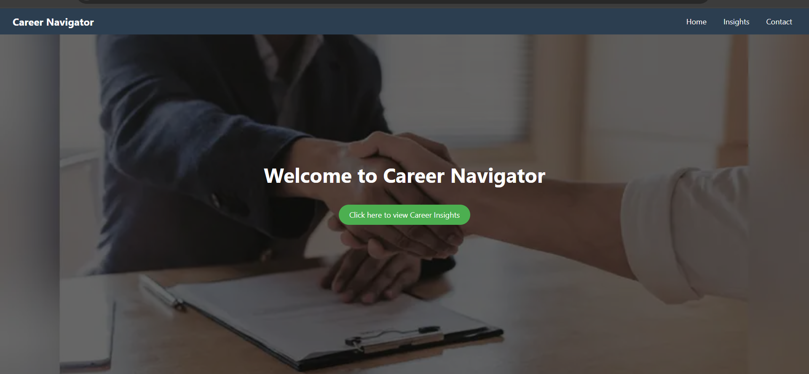
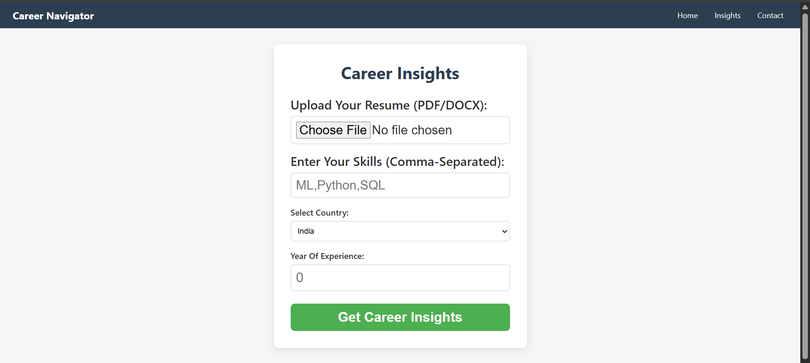

# Career Navigator 🌐🧠

A responsive frontend website designed to help users explore career insights, job trends, and resume tips.

## 📌 Features:
- Homepage with Navbar
- Career Insight Section
- Contact Form

## 🛠️ Tech Stack:
- HTML
- CSS
- JavaScript

## 🔗 Live Preview:
👉 [Click here to view live site](https://harshita-v5.github.io/Career-Navigator)

## 🖼️ Screenshots:

## 💡 Learnings:
- CSS Flexbox/Grid
- Mobile Responsiveness
- DOM Manipulation with JavaScript

## 📬 Contact:
Feel free to connect at:
 Email:harshitavashisht11@gmail.com
 LinkedIn:[Harshita Vashisht](https://www.linkedin.com/in/harshita-vashisht-651b3a287/)
